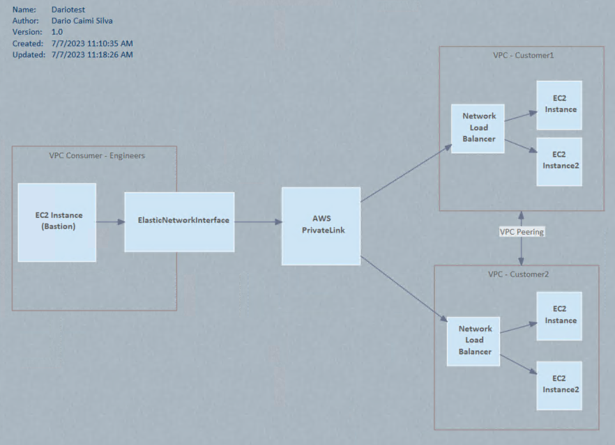
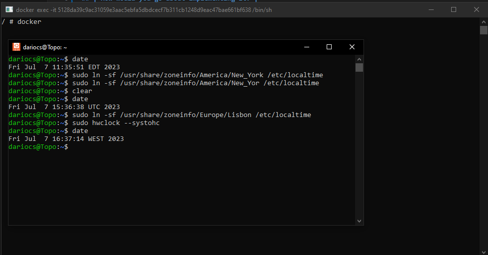

## Step1:| AWS Solution to provide private access from a single point |
For the RDP and HTTPS access to the servers and web apps, we should configure the security groups to achive this secure restriction.
To provide the engineers to access privately from a single point of access, I think the best way its using an AWS Private Link, check architectural diagram design.

## Step2: |Which AWS services or tools you leverage? WAF and GuardDuty|

## | Why?|
There are several ways and powerful tools that can be used and work together to provide a security solution. In terms of HTTPS, what comes to mind is having a Web Application Firewall (WAF) that helps protect our web applications from web exploits and has the ability to create security rules to filter out malicious traffic.
As I mentioned, we can use many services and tools, but one tool I have used in the past is GuardDuty. It provides proactive threat detection by monitoring the AWS environment for suspicious activity. It analyzes network traffic, DNS data, and can also be used to detect potential attacks on your HTTPS traffic.

## | How would you go about implementing it? |
There are several ways and powerful tools that can be used together to provide a security solution. In terms of HTTPS, one tool that comes to mind is WAF. It helps protect web applications from web exploits and allows us to create security rules to filter out malicious traffic.

Another tool that can be used is GuardDuty, which provides proactive threat detection. It monitors the AWS environment for suspicious activity, analyzes network traffic, DNS data, and can also detect potential attacks on HTTPS traffic.

To implement these two applications, I would suggest following these specific steps:

WAF:

Enable AWS WAF on our account and configure it to work with our services such as EC2 instances, Application Load Balancer, or API Gateway, depending on our application architecture.
Define and create custom WAF rules to filter and block malicious traffic.
Configure Access Control Lists (ACLs) for each rule.
Enable logging to capture information and store it in a destination like S3, for example.

GuardDuty:
Enable GuardDuty at the AWS account level to cover all regions and services within the account, if required.
GuardDuty provides a dashboard to check findings, and you can also set up notifications.
Integrate GuardDuty with other services like CloudWatch to trigger actions based on specific findings.
The implementation details may vary depending on the environment setup and the level of detail you want to capture. These steps serve as a starting point for configuring and utilizing WAF and GuardDuty effectively

Shield could be another option as well.. but I need to read the documentation...

## Step3: | Which method can you use for enabling the customer to reach the new feature with same 443 port |

Taking advantage of the IIS, one of the options could be reverse proxy configured on IIS using the URL rewrite module, enabling this we can route the incoming requests to the backend server, which will allow us to host multiple apps providing same entry point for clients (same port)

I think port forwarding could be used as wel..

## Step4: | Change timezone on a docker linux machine |

You can change directly on the linux container vm by executing 
date (to check current timezone config)
sudo ln -sf /usr/share/Europe/Lisbon /etc/localtime
date (to check if change have been applied or not)

There are couple of ways to set the timezone.
set the TZ variable and then the NTP server configuration to sync all the containers.
if you have lot of linux docker machines, you can use the DockerFile to invoce the tzdata package.

## Ref materials used to complete the scripting steps (5,6 & 7)
https://registry.terraform.io/providers/hashicorp/aws/latest/docs/resources/ec2_host
https://docs.aws.amazon.com/powershell/latest/userguide/pstools-ec2.html
https://registry.terraform.io/modules/terraform-aws-modules/elb/aws/latest
https://registry.terraform.io/providers/hashicorp/aws/latest/docs/resources/cloudformation_stack
https://registry.terraform.io/providers/hashicorp/aws/latest/docs/resources/lb